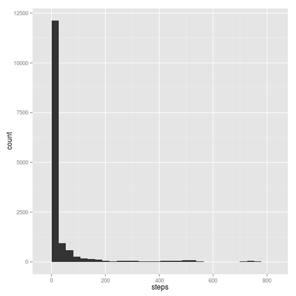
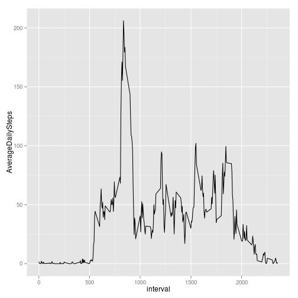
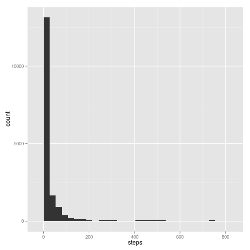
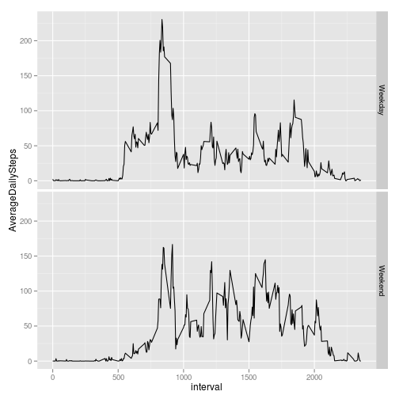

## Loading and preprocessing the data

Unzip the file and read the csv

```r
unzip(zipfile = "activity.zip")
activity <- read.csv(file = "activity.csv", header = TRUE)
```


## What is mean total number of steps taken per day?

Load the ggplot2 library, plotting a histogram of number of steps per day.

```r
library(ggplot2)
qplot(steps, data = activity, geom = "histogram")
```

```
## stat_bin: binwidth defaulted to range/30. Use 'binwidth = x' to adjust this.
```

 

Then compute the median and mean number of steps.

```r
median(activity$steps, na.rm = TRUE)
```

```
## [1] 0
```

```r
mean(activity$steps, na.rm = TRUE)
```

```
## [1] 37.3826
```


## What is the average daily activity pattern?

First we aggregate the steps by mean daily interval, then plot the activity.

```r
periodicActivity <- aggregate(activity$steps, by = list(activity$interval), 
                              FUN = mean, na.rm = TRUE)
names(periodicActivity) <- c("interval","AverageDailySteps")
qplot(x = interval, y = AverageDailySteps, data = periodicActivity, geom = "line")
```

 

Next, we determine the max average interval using dplyr to slice the data.

```r
library(dplyr)
max <- periodicActivity %>%
           arrange(desc(AverageDailySteps)) %>%
           slice(1)
max$interval
```

```
## [1] 835
```


## Imputing missing values

First sum over all NA values for number of steps to determine number missing.

```r
sum(is.na(activity$steps))
```

```
## [1] 2304
```

To impute, we will take the average 5-minute interval values to fill in any 
missing NA values.  We pull these from the periodicActivity data just created,
and merge to create the imputed data set.

```r
# Left join to get all data from activity data set
merged <- merge(x = activity, y = periodicActivity, all.x = TRUE, by = "interval")
merged$steps <- ifelse(is.na(merged$steps), merged$AverageDailySteps, merged$steps)
imputed <- merged[,1:3]
```

Finally, we plot the histogram and determine the median/mean values.  We see no
changes from the initial data set.

```r
qplot(steps, data = imputed, geom = "histogram")
```

```
## stat_bin: binwidth defaulted to range/30. Use 'binwidth = x' to adjust this.
```

 

```r
median(imputed$steps, na.rm = TRUE)
```

```
## [1] 0
```

```r
mean(imputed$steps, na.rm = TRUE)
```

```
## [1] 37.3826
```

## Are there differences in activity patterns between weekdays and weekends?

Use the weekdays function to determine the weekday for each date.  Then, create
the dayType factor variable to show weekday vs. weekend.

```r
imputed$day <- weekdays(as.Date(as.character(imputed$date)))
imputed$dayType <- factor(ifelse(imputed$day %in% c("Saturday","Sunday"),
                                 "Weekend","Weekday"))

periodicByDate <- aggregate(imputed$steps, by = list(imputed$interval, imputed$dayType), 
                            FUN = mean, na.rm = TRUE)
names(periodicByDate) <- c("interval","dayType","AverageDailySteps")
```

Then, aggregate by interval and weekday vs. weekend to create a facet plot.  We
see that weekdays have a stronger early morning peak activity, while weekends
show stronger activity throughout the day.

```r
qplot(x = interval, y = AverageDailySteps, data = periodicByDate, 
      geom = "line", facets = dayType ~ .)
```

 
